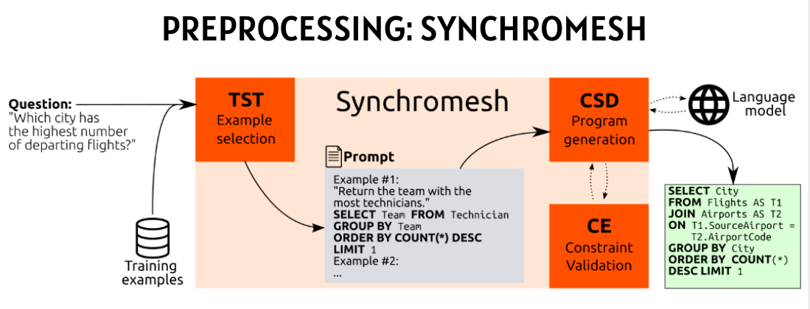
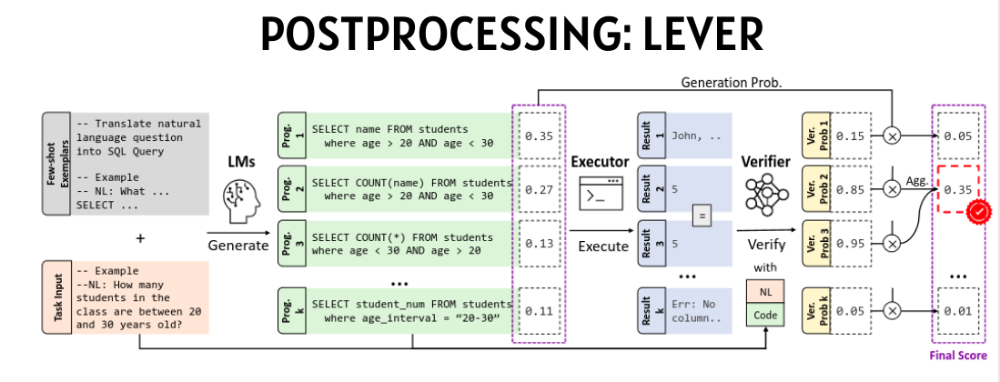

ai-bakcend
<h1 align="center">
  
   
  CodeForge
</h1>

   <strong>CodeForge</strong> - AI powered funciton generator

**HackNiche 2.0 || Generating Adversarial Thoughts**    
<!--   Add any <a href="https://shields.io/">Shields</a> here -->
<!--  -->

---

## 📝Description

With the rise in generative AI technologies, our project harnesses the power of natural language processing to automate function code generation from text prompts. By enabling structured input and output, real-time testing, and validation, our tool facilitates rapid prototyping of data processing algorithms. With a user-friendly interface and robust backend, developers can efficiently create code using pseudocode generation and LLM-assisted development. Our project aims to streamline the code generation process and improve overall development productivity

### Approach 

Next, we employed freely accessible opensource models. Llama2 is finetuned on SQl data.
 Natural language question invokes an Open Search query.
Based on the question, schema, and sample SQL, the prompt is created and the model is invoked

## 🤖Tech-Stack

#### Front-end

- 
 

#### Back-end

- 
- 
- 

---

## 🔮Future Scope
- Allow Code Execution Real Time in browser
- Provide inference for Foundation LLMs in browser
- Support for multiple frameworks

---

## :star: Team - Generating Advaersarial Thoughts

- [Sameer Gupta](https://github.com/sameergupta4873) 
- [Soham Mulye](https://github.com/Shazam213)
- [Dhruvanshu Joshi](https://github.com/Dhruvanshu-Joshi)
- [Labib Asari](https://github.com/labeeb-7z) 

